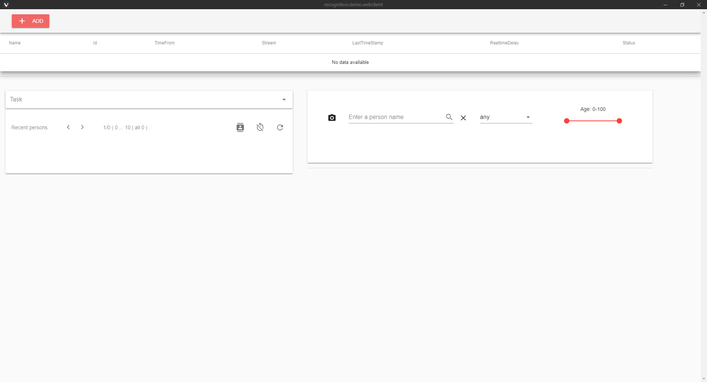
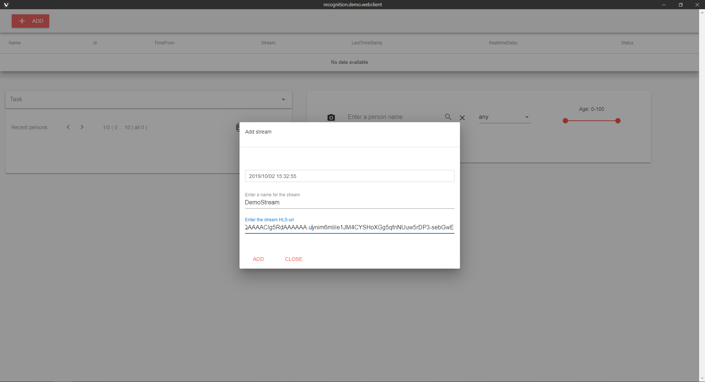
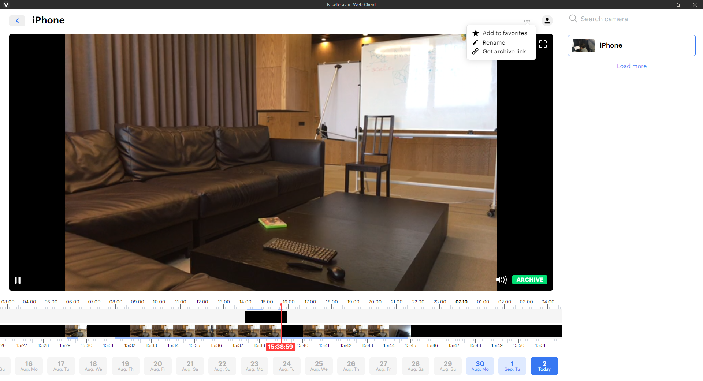
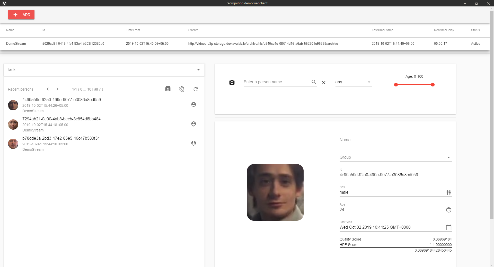
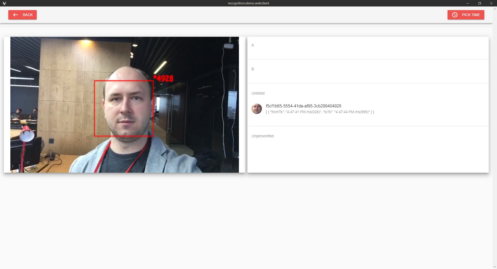

# Faceter FOG Client

[](LICENSE)

Faceter FOG Client is amazing intelligent face recognition engine which will provide token utilization for Faceter token holders. Based on a few neural networks created by Faceter team.

**System requirements**  
1. Linux OS compatible with Debian 9
2. Nvidia 10XX graphics card with 4GB+ RAM
3. CUDA 10+
4. RAM 12GB+
5. Linux kernel version 4.9+
6. Docker CE for Linux 18.06.0+
7. Python 3.6.7+

**Faceter FOG Client Installation Guide:**

**1. Download & Install Nvidia drivers**

Find drivers for your graphics card on the following page
[Nvidia](https://www.nvidia.com/DOWNLOAD/INDEX.ASPX?LANG=EN)

Install appropriate drivers. Note that this will require ~600Mb free disk space.  
For example:
```bash
wget http://us.download.nvidia.com/XFree86/Linux-x86_64/430.34/NVIDIA-Linux-x86_64-430.34.run 
chmod 755 NVIDIA-Linux-x86_64-430.34.run
sudo apt install gcc
sudo ./NVIDIA-Linux-x86_64-430.34.run
```

Probably you will need to install linux-headers.

**2. Install Docker CE**

```bash
sudo apt-get update
```

```bash
sudo apt-get install \
    apt-transport-https \
    ca-certificates \
    curl \
    gnupg2 \
    software-properties-common
```

```bash
curl -fsSL https://download.docker.com/linux/debian/gpg | sudo apt-key add -
```

```bash
sudo apt-key fingerprint 0EBFCD88
```

```bash
sudo add-apt-repository \
   "deb [arch=amd64] https://download.docker.com/linux/debian \
   $(lsb_release -cs) \
   stable"
```

```bash
sudo apt-get update
```

```bash
sudo apt-get install docker-ce
```

**2.1. Install docker-compose**

```bash
sudo curl -L https://github.com/docker/compose/releases/download/1.24.1/docker-compose-`uname -s`-`uname -m` -o /usr/local/bin/docker-compose
```

```bash
sudo chmod +x /usr/local/bin/docker-compose
```

**2.2. Install nvidia-docker**

```bash
distribution=$(. /etc/os-release;echo $ID$VERSION_ID)
```

```bash
curl -s -L https://nvidia.github.io/nvidia-docker/gpgkey | sudo apt-key add -
```

```bash
curl -s -L https://nvidia.github.io/nvidia-docker/$distribution/nvidia-docker.list | sudo tee /etc/apt/sources.list.d/nvidia-docker.list
```

```bash
sudo apt-get update && sudo apt-get install -y nvidia-container-toolkit
```

```bash
sudo systemctl restart docker
```

```bash
sudo apt install nvidia-docker2
```

_If you get an error  
ERROR: for recognition-scorer  Cannot create container for service recognition-scorer: Unknown runtime specified nvidia_

_Try to fix this with (learn more at [StackOverflow](https://stackoverflow.com/questions/52865988/nvidia-docker-unknown-runtime-specified-nvidia))_

```bash
sudo systemctl daemon-reload
```

```bash
sudo systemctl restart docker
```

**3. Installing FR Node + Demo**

**3.1. Install & Run:**

```bash
git clone https://github.com/faceterteam/FaceterFOGClient.git
```

```bash
cd FaceterFOGClient
```

```bash
docker-compose pull
```

```bash
docker-compose up -d
```

**3.2. Update:**

```bash
docker-compose down
```

```bash
git pull
```

```bash
docker-compose pull
```

```bash
docker-compose up -d
```

**3.3. Demo**

Navigate to [http://localhost](http://localhost) (or address of your server, where docker-compose was installed) to access node admin panel:



Add video stream url:



In order to get a link to the archive you need:

1. Install Faceter Phone (learn more at [Medium](https://medium.com/@Faceter/faceter-phone-installation-guide-529f1b783f))  
2. Sign in [Faceter Cloud Client](https://cloud.faceter.cam/public/)  
3. Open the camera control menu and get a link to the archive



After adding video stream it should be displayed in the Streams section and have Active status, which means that it’s analysis has started:



Now you can check for the face recognition results:

