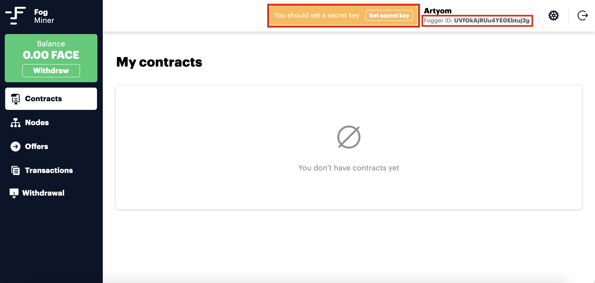

# Faceter Fog Client

[](LICENSE)

Faceter Fog Client is amazing intelligent face recognition engine which will provide token utilization for Faceter token holders. Based on a few neural networks created by Faceter team.

## System requirements

1. Linux OS compatible with Debian 9
2. Nvidia 10XX graphics card with 4GB+ RAM
3. CUDA 10+
4. RAM 12GB+
5. Storage 18 GB Hard drive space
6. Linux kernel version 4.9+
7. Docker CE for Linux 18.06.0+
8. Python 3.6.7+

## Faceter Fog Client Installation Guide

### 1. Download & Install Nvidia drivers

Identification of your video card  
The NVIDIA graphics processing unit (GPU) series/codename of an installed video card can usually be identified using the lspci command.  
For example:

```bash
lspci -nn | egrep -i "3d|display|vga"
```

Find drivers for your graphics card on the following page
[Nvidia](https://www.nvidia.com/DOWNLOAD/INDEX.ASPX?LANG=EN)

Install appropriate drivers. Note that this will require ~600Mb free disk space.  
For example:

```bash
wget http://us.download.nvidia.com/XFree86/Linux-x86_64/430.34/NVIDIA-Linux-x86_64-430.34.run  
chmod 755 NVIDIA-Linux-x86_64-430.34.run
sudo apt install gcc
sudo apt install make
sudo ./NVIDIA-Linux-x86_64-430.34.run
```

If during NVIDIA drivers installation you have an error:

```error
ERROR: The Nouveau kernel driver is currently in use by your system.  This driver is incompatible with the NVIDIA driver, and must be disabled before proceeding.  Please consult the NVIDIA driver README and your Linux distribution's documentation for details on how to correctly disable the Nouveau kernel driver.
```

So, before proceeding installation NVIDIA drivers on Ubuntu you must disable Nouveau kernel driver. To disable the default Nouveau Nvidia driver.
Run command:

```bash
echo "blacklist nouveau"|sudo tee -a /etc/modprobe.d/blacklist.conf
```

Regenerate the kernel initramfs:

```bash
sudo update-initramfs -u
```

And reboot your system:

```bash
sudo reboot
```

Now you can continue install the NVIDIA drivers on Ubuntu.

Probably you will need to install linux-headers.

After installing the driver, you have to do

```bash
sudo reboot
```

In order to make sure that the driver is successfully installed, run

```bash
sudo nvidia-smi
```

### 2. Install Docker CE

```bash
sudo apt-get update
```

```bash
sudo apt-get install \
    apt-transport-https \
    ca-certificates \
    curl \
    gnupg2 \
    software-properties-common
```

[If you use Ubuntu](https://docs.docker.com/install/linux/docker-ce/ubuntu/)

```bash
curl -fsSL https://download.docker.com/linux/ubuntu/gpg | sudo apt-key add -
sudo apt-key fingerprint 0EBFCD88
sudo add-apt-repository \
   "deb [arch=amd64] https://download.docker.com/linux/ubuntu \
   $(lsb_release -cs) \
   stable"
sudo apt-get update
sudo apt-get install docker-ce
```

[If you use Debian](https://docs.docker.com/install/linux/docker-ce/ubuntu/)

```bash
curl -fsSL https://download.docker.com/linux/debian/gpg | sudo apt-key add -
sudo apt-key fingerprint 0EBFCD88
sudo add-apt-repository \
   "deb [arch=amd64] https://download.docker.com/linux/debian \
   $(lsb_release -cs) \
   stable"
sudo apt-get update
sudo apt-get install docker-ce
```

### 2.1. Install docker-compose

```bash
sudo curl -L https://github.com/docker/compose/releases/download/1.24.1/docker-compose-`uname -s`-`uname -m` -o /usr/local/bin/docker-compose

sudo chmod +x /usr/local/bin/docker-compose
```

If you would like to use Docker as a non-root user, you should now consider adding your user to the “docker” group with something like:

```bash
sudo usermod -aG docker your-user-name
```

### 2.2. Install nvidia-docker

```bash
distribution=$(. /etc/os-release;echo $ID$VERSION_ID)

curl -s -L https://nvidia.github.io/nvidia-docker/gpgkey | sudo apt-key add -

curl -s -L https://nvidia.github.io/nvidia-docker/$distribution/nvidia-docker.list | sudo tee /etc/apt/sources.list.d/nvidia-docker.list
```

```bash
sudo apt-get update  
sudo apt-get install -y nvidia-container-toolkit
sudo systemctl restart docker
sudo apt install nvidia-docker2
```

_If you get an error  
ERROR: for recognition-scorer  Cannot create container for service recognition-scorer: Unknown runtime specified nvidia_

_Try to fix this with (learn more at [StackOverflow](https://stackoverflow.com/questions/52865988/nvidia-docker-unknown-runtime-specified-nvidia))_

```bash
sudo systemctl daemon-reload
sudo systemctl restart docker
```

## 3. Installing FR Node

### 3.1. Install & Run

```bash
git clone https://github.com/faceterteam/FaceterFOGClient.git
cd FaceterFOGClient
docker-compose pull
docker-compose up -d
```

### 3.2. Update

```bash
docker-compose down
git pull
docker-compose pull
docker-compose up -d
```

### 3.3. Get & Run Agent

Get the Agent for Faceter Fog Client [here](agent/fogagent) It is linux-x64 execute binary.

The agent must be runned on the host operating system with required parameters: `foggerid` and `nodeid`.

```bash
chmod +x fogagent
fogagent --foggerid <your-fogger-id> --nodeid <your-node-id>
```

`foggerid` can be get from the miner's account:


`nodeid` needs to be invented. It will be used to uniquely identify the node and should be an alphanumeric value without spaces.

After starting, the Agent registers the node and collects information about the configuration of the node:


And the registered year can be seen in the miner's account:
