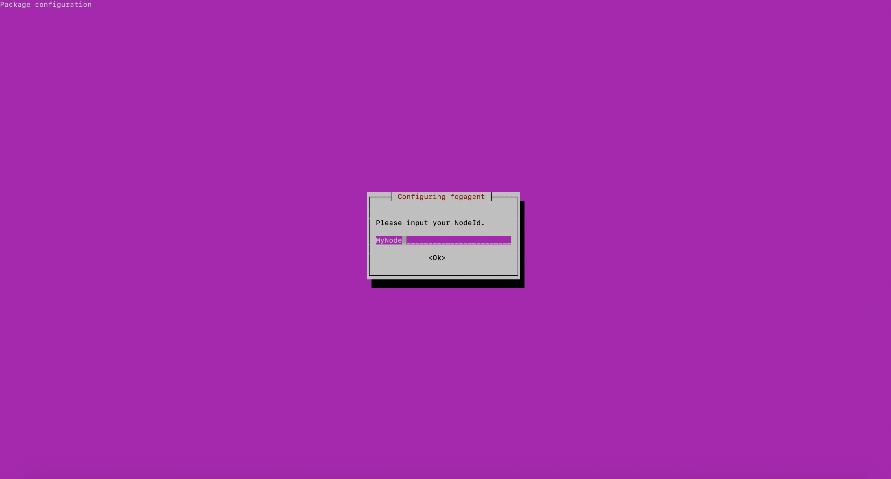
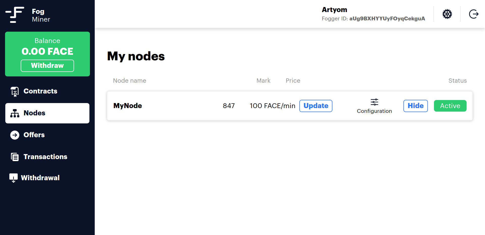

# Faceter Fog Client

[](LICENSE)

Faceter Fog Client is a software designed to build decentralized computing network mainly focused on CCTV streams processing. It utilizes ERC-20 FACE tokens a payment mechanism for both owners of the cameras and node operators (miners) 

## System requirements

1. Linux OS compatible with Debian 9
2. AMD64 architecture required
3. Nvidia 10XX graphics card with 4GB+ RAM
4. CUDA 10+
5. RAM 12GB+
6. Storage 18 GB Hard drive space
7. Linux kernel version 4.9+
8. Docker CE for Linux 18.06.0+
9. Python 3.6.7+

## Faceter Fog Client Installation Guide

### 1. Download & Install Nvidia drivers

Identification of your video card  
The NVIDIA graphics processing unit (GPU) series/codename of an installed video card can usually be identified using the lspci command.  
For example:

```bash
lspci -nn | egrep -i "3d|display|vga"
```

Find drivers for your graphics card on the following page
[Nvidia](https://www.nvidia.com/DOWNLOAD/INDEX.ASPX?LANG=EN)

Install appropriate drivers. Note that this will require ~600Mb free disk space.  
For example:

```bash
wget http://us.download.nvidia.com/XFree86/Linux-x86_64/430.34/NVIDIA-Linux-x86_64-430.34.run  
chmod 755 NVIDIA-Linux-x86_64-430.34.run
sudo apt install gcc
sudo apt install make
sudo ./NVIDIA-Linux-x86_64-430.34.run
```

If during NVIDIA drivers installation you have an error:

```error
ERROR: The Nouveau kernel driver is currently in use by your system.  This driver is incompatible with the NVIDIA driver, and must be disabled before proceeding.  Please consult the NVIDIA driver README and your Linux distribution's documentation for details on how to correctly disable the Nouveau kernel driver.
```

So, before proceeding installation NVIDIA drivers on Ubuntu you must disable Nouveau kernel driver. To disable the default Nouveau Nvidia driver.
Run command:

```bash
echo "blacklist nouveau"|sudo tee -a /etc/modprobe.d/blacklist.conf
```

Regenerate the kernel initramfs:

```bash
sudo update-initramfs -u
```

And reboot your system:

```bash
sudo reboot
```

Now you can continue to install the NVIDIA drivers on Ubuntu.

Probably you will need to install linux-headers.

After installing the driver, you have to do

```bash
sudo reboot
```

In order to make sure that the driver is successfully installed, run

```bash
sudo nvidia-smi
```

### 2. Install Docker CE

```bash
sudo apt-get update
```

```bash
sudo apt-get install \
    apt-transport-https \
    ca-certificates \
    curl \
    gnupg2 \
    software-properties-common
```

[If you use Ubuntu](https://docs.docker.com/install/linux/docker-ce/ubuntu/)

```bash
curl -fsSL https://download.docker.com/linux/ubuntu/gpg | sudo apt-key add -
sudo apt-key fingerprint 0EBFCD88
sudo add-apt-repository \
   "deb [arch=amd64] https://download.docker.com/linux/ubuntu \
   $(lsb_release -cs) \
   stable"
sudo apt-get update
sudo apt-get install docker-ce
```

[If you use Debian](https://docs.docker.com/install/linux/docker-ce/ubuntu/)

```bash
curl -fsSL https://download.docker.com/linux/debian/gpg | sudo apt-key add -
sudo apt-key fingerprint 0EBFCD88
sudo add-apt-repository \
   "deb [arch=amd64] https://download.docker.com/linux/debian \
   $(lsb_release -cs) \
   stable"
sudo apt-get update
sudo apt-get install docker-ce
```

If you would like to use Docker as a non-root user, you should now consider adding your user to the “docker” group with something like:

```bash
sudo usermod -aG docker your-user-name
```

### 2.1. Install nvidia-docker

```bash
distribution=$(. /etc/os-release;echo $ID$VERSION_ID)

curl -s -L https://nvidia.github.io/nvidia-docker/gpgkey | sudo apt-key add -

curl -s -L https://nvidia.github.io/nvidia-docker/$distribution/nvidia-docker.list | sudo tee /etc/apt/sources.list.d/nvidia-docker.list
```

```bash
sudo apt-get update  
sudo apt-get install -y nvidia-container-toolkit
sudo systemctl restart docker
sudo apt install nvidia-docker2
```

_If you get an error  
ERROR: for recognition-scorer  Cannot create a container for service recognition-scorer: Unknown runtime specified nvidia_

_Try to fix this with (learn more at [StackOverflow](https://stackoverflow.com/questions/52865988/nvidia-docker-unknown-runtime-specified-nvidia))_

```bash
sudo systemctl daemon-reload
sudo systemctl restart docker
```

## 3. Installing Faceter Fog Client

### 3.1. Get & Run Agent

For a start need [registered as a miner](https://fog.faceter.cam/miner/signup)

Follow the next steps to installing Fog Agent for Faceter Fog Client as a deb-package.

1. Installing the Faceter public GPG key.

```bash
wget -O - 'https://repo.faceter.cam/gpg.key' | sudo apt-key add -
```

2. Add repository.

```bash
sudo bash -c 'echo "deb https://repo.faceter.cam/apt/ debian main" > /etc/apt/sources.list.d/faceter.list'
```

3. Update the Apt repository cache.

```bash
sudo apt update
```

4. Install fogagent.

```bash
sudo apt install fogagent
```

During installation, you must specify your `foggerid`


and `nodeid`



Also, Fog Agent can be launched in the host operating system with the following parameters: `--foggerid` and `--nodeid`. In this case, the parameters from the configuration will be overridden.

```bash
fogagent --foggerid <your-fogger-id> --nodeid <your-node-id>
```

To automatically start Fog Agent at login, you can run the following command.

```bash
sudo systemctl enable fogagent
sudo service fogagent start
```

or

```bash
sudo update-rc.d -f fogagent defaults
sudo service fogagent start
```

To change the configuration you can use
```bash
sudo dpkg-reconfigure fogagent
```

For launch `foggerid` can be obtained from the miner's account:


Choose `nodeid` for for future identification of this machine. It should be unique alphanumeric value without spaces.

**Since version 0.7.0** Fog Agent as part of the Faceter Fog Client starting to be able to download and install all required parts of the Client by it own.

All Fog Agent's actions should be written into the terminal (non-service running mode) and to log files, located at
`/var/log/fogagent/yyyyMMdd.log`

After first time installation Fog Agent will check several conditions on the local machine:
* existing version of NVIDIA graphic driver
* existing version of NVIDIA CUDA
* existing version of Docker service

When environment conditions will be passed, Fog Agent will check Faceter Fog Client docker images existing, their tags then download and install the newest if needed.

Fog Agent will collect the information about your node and register it in your account.


After successful registration you will be able to see and manage the node from your account:


Set up the price for 1 minute of video processing to make your node available to the market



That is it! Now you can connect your cameras to Faceter Cloud and try Faceter Fog as a client.

IMPORTANT NOTICE: This is one of the very first publicly available builds of Faceter Fog. If you find a bug or another issue, please post it here on Github with a full description of your case.
